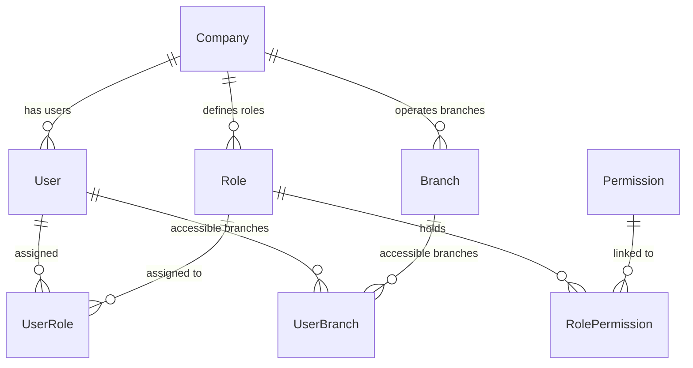
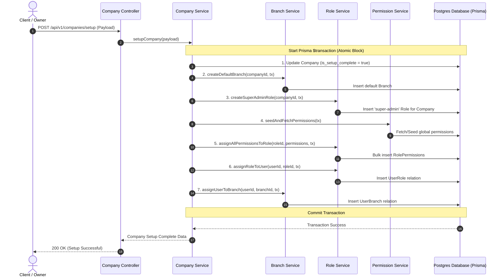

# Multi-Tenant Role & Permission Setup Architecture

This document describes the design and implementation strategy for the **Role-Based Access Control (RBAC)** initialization during the first-time company setup in our multi-tenant ERP system. It outlines how we solve the modular separation problem when orchestrating roles, permissions, branches, and users under a unified transaction.

---

## 1. Database Schema Analysis & Critical Review

By analyzing [schema.prisma](file:///d:/MyDev/business/erp/backend/prisma/schema.prisma), we observe the following relationships between the authentication and multi-tenancy models:



### Key Architectural Constraints
1. **Multi-Tenancy for Users & Roles**: 
   - `User` belongs to a `Company` (`companyId` key).
   - `Role` belongs to a `Company` (`companyId` key). This enables custom roles per company.
2. **Global System Permissions**:
   - `Permission` is a global lookup table (no `companyId`). Permissions like `create_user` or `view_product` are standardized system-wide.
3. **Branch Access Control**:
   - Users are associated with branches via a junction table `UserBranch` rather than a direct column, allowing a single user to manage multiple branches.

> [!WARNING]
> ### Critical Schema Defect Detected: Global Role Uniqueness
> In [schema.prisma:L33](file:///d:/MyDev/business/erp/backend/prisma/schema.prisma#L33), the `Role` model defines `role_name` as globally unique:
> ```prisma
> model Role {
>   role_name String @unique @db.VarChar(100)
> }
> ```
> In a multi-tenant ERP system where each `Role` is associated with a specific `companyId`, this **breaks multi-tenancy**. Once Company A creates a role named `"super-admin"`, Company B will receive a `500 Unique Constraint Violation` error if they also try to create a `"super-admin"` role.
> 
> **Recommended Fix**:
> Remove `@unique` from the `role_name` property and declare a compound uniqueness constraint at the model level so that role names are only unique *within* the same company:
> ```prisma
> model Role {
>   id              String           @id @default(uuid()) @db.Uuid
>   role_name       String           @db.VarChar(100)
>   companyId       String           @db.Uuid
>   // ... other fields
>   
>   @@unique([companyId, role_name]) // Combines company context with role name
>   @@map("roles")
> }
> ```

---

## 2. Orchestrated Setup Architecture (Solving the Separation Problem)

### The Problem
In clean, modular backend architectures, business modules are decoupled:
* The `CompanyModule` manages company profiles.
* The `UserModule` handles user onboarding.
* The `RoleModule` and `PermissionModule` manage access control.

However, during **first-time company setup** (`setupCompany` service), all of these domains collide. We must atomically:
1. Update the `Company` profile to complete setup.
2. Ensure a default `Branch` is created.
3. Establish the default `super-admin` `Role` for this company.
4. Gather all system `Permissions` and map them to the `super-admin` role in `RolePermission`.
5. Associate the setup `User` with the `super-admin` role in `UserRole`.
6. Associate the setup `User` with the default `Branch` in `UserBranch`.

If any of these steps fail, we must roll back all changes to avoid corrupt half-configured tenants (e.g., a company marked as "setup complete" but having no admin user or roles).

### The Architecture: Transaction Coordinator Pattern
To solve this cleanly without leaking raw database logic or breaking modular boundaries, we implement the **Transaction Coordinator Pattern** inside the `CompanyService`.

Instead of having modules directly write to each other's databases, modules expose **granular service operations** that can accept an optional **Prisma Transaction Client instance** (`tx`). This allows the `CompanyService` to coordinate the flow inside a global `$transaction` block.

#### High-Level Sequence Flow:


---

## 3. Comprehensive Permission Registry (Schema-Expanded)

A thorough review of the current database models reveals several gaps between the user-requested default permissions and the actual database resources (such as Suppliers, Customers, VAT rates, Categories, Units, etc.). 

To construct a robust system, we organize the full, production-ready system permissions below:

### I. User & Access Management (Predefined)
* `create_user` — Invite or add a new user to the company.
* `view_user` — View profiles and branch assignments of company staff.
* `update_user` — Edit staff profiles or change branch restrictions.
* `delete_user` — Suspend or remove users from the company context.
* `assign_role` — Grant or modify roles assigned to users.

### II. Product & Catalog Management (Expanded)
* `create_product` — Add new products/services to the catalog.
* `view_product` — View the product registry, SKUs, and pricing sheets.
* `update_product` — Modify product specifications, SKU codes, and barcodes.
* `delete_product` — Archive or delete catalog products.
* `manage_pricing` — Update buying prices, retail prices, and discounts.
* **[NEW]** `manage_categories` — Full CRUD for Product Categories and Subcategories (crucial for [Category](file:///d:/MyDev/business/erp/backend/prisma/schema.prisma#L193) and [SubCategory](file:///d:/MyDev/business/erp/backend/prisma/schema.prisma#L207) models).
* **[NEW]** `manage_units` — Configure measurement scales (pieces, boxes, kg) under the [Unit](file:///d:/MyDev/business/erp/backend/prisma/schema.prisma#L221) model.

### III. Sales & POS Operations (Expanded)
* `create_sales_order` — Initiate table, counter, or delivery orders.
* `create_sales_invoice` — Generate billing invoices for checkout.
* `view_sales` — Access historical sales tickets and transaction logs.
* `process_payment` — Input payments received for invoices.
* `apply_discount` — Override standard prices with custom discount percentages.
* **[NEW]** `manage_customers` — Manage profile cards and balances for [Customer](file:///d:/MyDev/business/erp/backend/prisma/schema.prisma#L431) models.

### IV. Purchase & Supply Operations (Expanded)
* `create_purchase_order` — Issue orders to supply chain merchants.
* `create_purchase_invoice` — Log incoming physical invoices and stock batches.
* `view_purchases` — Audit purchasing history.
* `approve_purchase` — Authorize a pending purchase request.
* **[NEW]** `manage_suppliers` — Edit and view profiles, ledgers, and opening balances for [Supplier](file:///d:/MyDev/business/erp/backend/prisma/schema.prisma#L322) models.

### V. Inventory & Warehouse Management (Predefined)
* `view_stock` — Review physical quantity balances across different branches.
* `adjust_stock` — Perform adjustments for damages, spills, or shrinkage.
* `transfer_stock` — Log cross-branch physical transfers.
* `view_stock_movements` — Track detailed audit logs of inventory input/output ([StockMovement](file:///d:/MyDev/business/erp/backend/prisma/schema.prisma#L304) model).

### VI. Financial & Ledger Operations (Expanded)
* `view_reports` — Access dashboard metrics, balance sheets, and tax summaries.
* `create_journal_entry` — Post debit/credit ledger records ([JournalEntry](file:///d:/MyDev/business/erp/backend/prisma/schema.prisma#L562) model).
* `view_accounts` — Browse the general Chart of Accounts ([Account](file:///d:/MyDev/business/erp/backend/prisma/schema.prisma#L551) model).
* `manage_payments` — Process accounts payable/receivable payments ([Payment](file:///d:/MyDev/business/erp/backend/prisma/schema.prisma#L530) model).

### VII. Tax & VAT Management (NEW - Crucial for Schema compliance)
* **[NEW]** `manage_tax_rates` — Configure local value-added tax rates ([TaxRate](file:///d:/MyDev/business/erp/backend/prisma/schema.prisma#L595) model).
* **[NEW]** `view_vat_reports` — Retrieve transactional tax audits and government compliance returns ([VatTransaction](file:///d:/MyDev/business/erp/backend/prisma/schema.prisma#L612) model).

### VIII. System Administration & Settings (Expanded)
* `manage_company` — Edit trade details, business categories, or core defaults.
* `manage_branch` — Open, edit, or disable company branches.
* `manage_roles` — Design customized employee roles with custom permission matrices.
* `manage_permissions` — Audit available system permissions.
* `system_settings` — Adjust overall localized variables and defaults.
* **[NEW]** `view_billing` — Access monthly subscription, tier limits, and invoice statements ([Subscription](file:///d:/MyDev/business/erp/backend/prisma/schema.prisma#L93) model).
* **[NEW]** `manage_billing` — Update credit cards, select tiers, and pay subscription invoices.

---

## 4. Architectural Implementation Blueprint

To build this cleanly in Express and Prisma, the design relies on decoupled service delegates receiving an active transaction runner client.

### A. Dynamic Seeding of the Permission Registry
At startup (or inside the transaction coordinator), the system verifies that the global permission database is up to date with our registry. This is handled by a permission sync mechanism that creates missing permissions.

### B. Modular Interface Design
Services should accept a transaction context (`tx`) as an optional parameter. If `tx` is provided, the database operations use the active transaction scope; otherwise, they fall back to the default `prisma` client.

```typescript
// Example Service Signature Concept
export const createRoleForCompany = async (
  companyId: string,
  roleName: string,
  tx?: PrismaTransactionClient
) => {
  const db = tx || prisma;
  return await db.role.create({
    data: {
      role_name: roleName,
      companyId,
    },
  });
};
```

### C. The Orchestrated Company Setup Transaction Flow
Inside `company.service.ts`, the execution follows this structure:

1. **Start Transaction** using `prisma.$transaction`.
2. **Execute Steps Sequentially**:
   - **Step 1**: Update company details and toggle `is_setup_complete` to `true`.
   - **Step 2**: Create the primary Branch for the company (e.g., `"HQ / Main Branch"`).
   - **Step 3**: Create the `"super-admin"` Role belonging to this company.
   - **Step 4**: Query all existing global `Permission` records from the database.
   - **Step 5**: Map all permission IDs to the `"super-admin"` role ID and bulk-insert them into the `RolePermission` table.
   - **Step 6**: Associate the initiating user ID with this new `"super-admin"` role ID in the `UserRole` table.
   - **Step 7**: Associate the initiating user ID with the primary Branch ID in the `UserBranch` table to ensure immediate data access.

---

## 5. Request Authorization Middleware Strategy

To protect API endpoints based on the newly initialized access control model, the authorization flow uses an efficient, high-performance database check.

When a client makes an authenticated request:

1. **Authentication (JWT Verification)**:
   - The token is verified.
   - The user's ID, `companyId`, and email are extracted.

2. **Access Authorization Middleware**:
   - Instead of checking roles (which can be custom-defined and volatile), endpoints are secured strictly by **Permissions** (e.g. `checkPermission('create_product')`).
   - The middleware performs a highly optimized Prisma query to determine if the user has access.

### Database Authorization Query Structure
To verify if a specific `userId` has a required `permissionString`, we execute a query that traverses the relationships in a single operation:

```prisma
// Theoretical Prisma query executed by the checkPermission middleware:
const hasPermission = await prisma.user.findFirst({
  where: {
    id: userId,
    userRoles: {
      some: {
        role: {
          rolePermissions: {
            some: {
              permission: {
                permission: permissionString
              }
            }
          }
        }
      }
    }
  }
});
```

* If `hasPermission` is non-null, the user is authorized and the request proceeds.
* If `hasPermission` is null, the middleware short-circuits the request and throws a `403 Forbidden - Insufficient Permissions` error.

This architecture ensures high performance, complete data consistency, and strict isolation between tenant environments.
